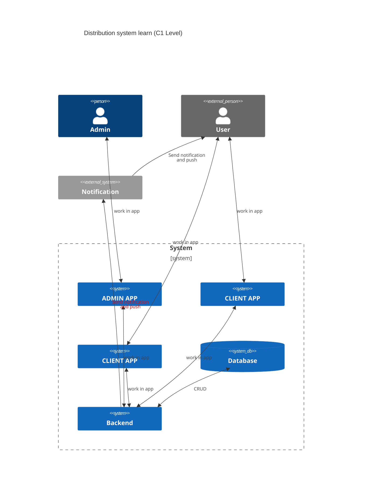

# distribution-system-lern

docker images

1. auth keycloak
2. balanser
3. s3 (minio)
- backet for files
- backet for frontend static
4. neo4j
5. pstgreSQL|noSQL

backends:

1. files storage
2. db graph adapter
3. postgress adapter

USE merminds as build-in C4-documentation

