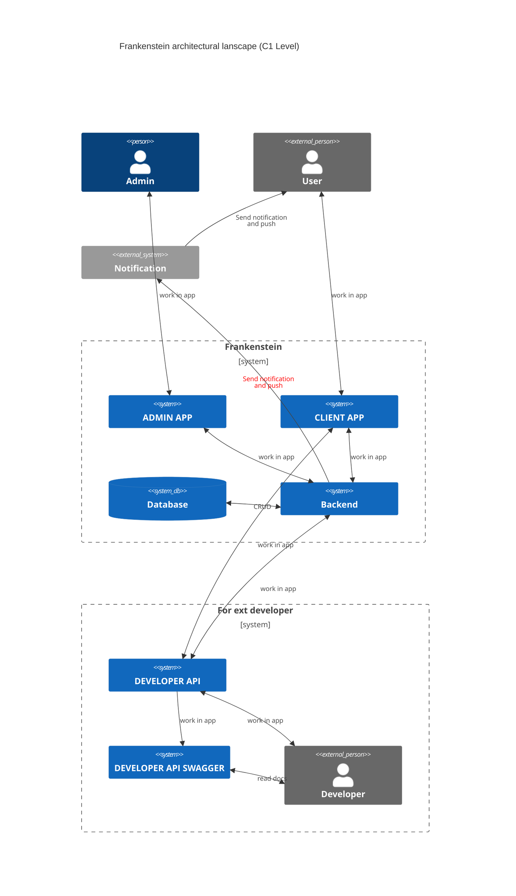

# Frankenstein architectural Landscape

```mermaid
C4Context

title Frankenstein architectural lanscape (C1 Level)

Person(Admin, "Admin")
Person_Ext(User, "User")

BiRel(User, web_client_app, "work in app")
BiRel(Admin, admin_client_app, "work in app")

System_Ext(notification_service, "Notification")
Rel(notification_service, User, "Send notification <br/> and push")

Boundary(system, "Frankenstein") {
    System(admin_client_app, "ADMIN APP")
    System(web_client_app, "CLIENT APP")

    SystemDb(database, "Database")

    System(backend, "Backend")

    BiRel(developer_client_api, web_client_app, "work in app")
    BiRel(admin_client_app, backend, "work in app")
    BiRel(web_client_app, backend, "work in app")
    BiRel(developer_client_api, backend, "work in app")

    Rel(backend, notification_service, "Send notification <br/> and push")
    BiRel(backend, database, "CRUD")

 UpdateLayoutConfig($systemShapeInRow="3", $systemBoundaryInRow="1")

     UpdateRelStyle(backend, notification_service, $textColor="red", $offsetY="-00")
}


Boundary(developer, "For ext developer"){
    System(developer_client_api, "DEVELOPER API")
    System(developer_client_api_swagger, "DEVELOPER API SWAGGER")

    Rel(developer_client_api, developer_client_api_swagger, "work in app")

    Person_Ext(Developer, "Developer")
    BiRel(Developer, developer_client_api, "work in app")
    BiRel(Developer, developer_client_api_swagger, "read docs")
}


```
