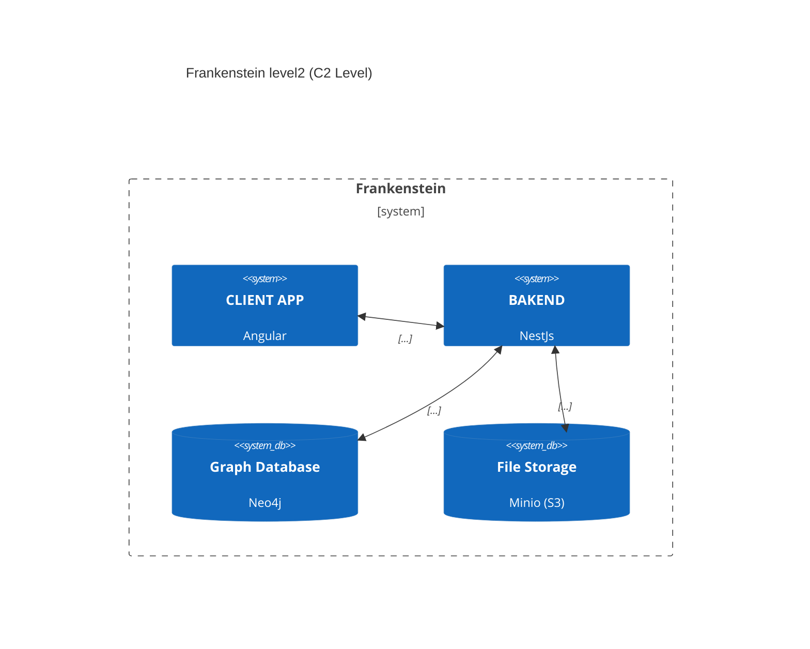

# Frankenstein C4 level2

```mermaid
C4Context

title Frankenstein level2 (C2 Level)

Boundary(system, "Frankenstein") {
    System(web_client_app, "CLIENT APP", "Angular")
    System(backend, "BAKEND", "NestJs")

    SystemDb(graph_database, "Graph Database", "Neo4j")
    SystemDb(file_storage, "File Storage", "Minio (S3)")

    BiRel(web_client_app, backend, , "...")
    BiRel(backend, graph_database, , "...")
    BiRel(backend, file_storage, , "...")
}
```
