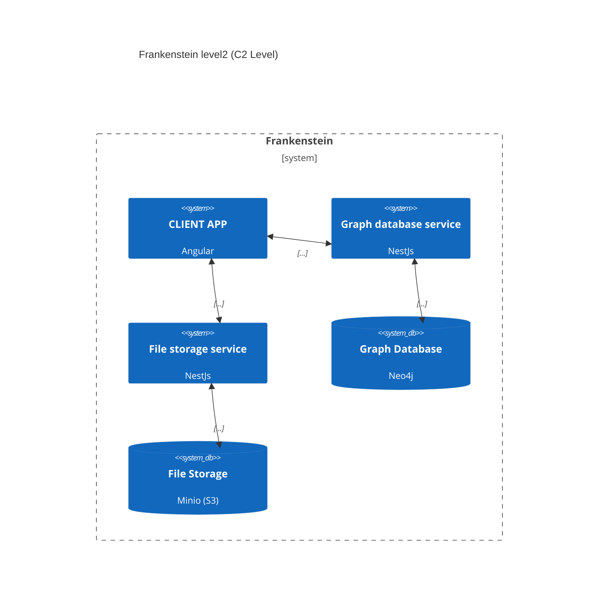

# Frankenstein C4 level2

```mermaid
C4Context

title Frankenstein level2 (C2 Level)

Boundary(system, "Frankenstein") {
    System(web_client_app, "CLIENT APP", "Angular")

    System(graph_db_backend, "Graph database service", "NestJs")
    System(file_storage_backend, "File storage service", "NestJs")

    SystemDb(graph_database, "Graph Database", "Neo4j")
    SystemDb(file_storage, "File Storage", "Minio (S3)")

    BiRel(web_client_app, graph_db_backend, , "...")
    BiRel(web_client_app, file_storage_backend, , "...")

    BiRel(graph_db_backend, graph_database, , "...")
    BiRel(file_storage_backend, file_storage, , "...")
}
```
