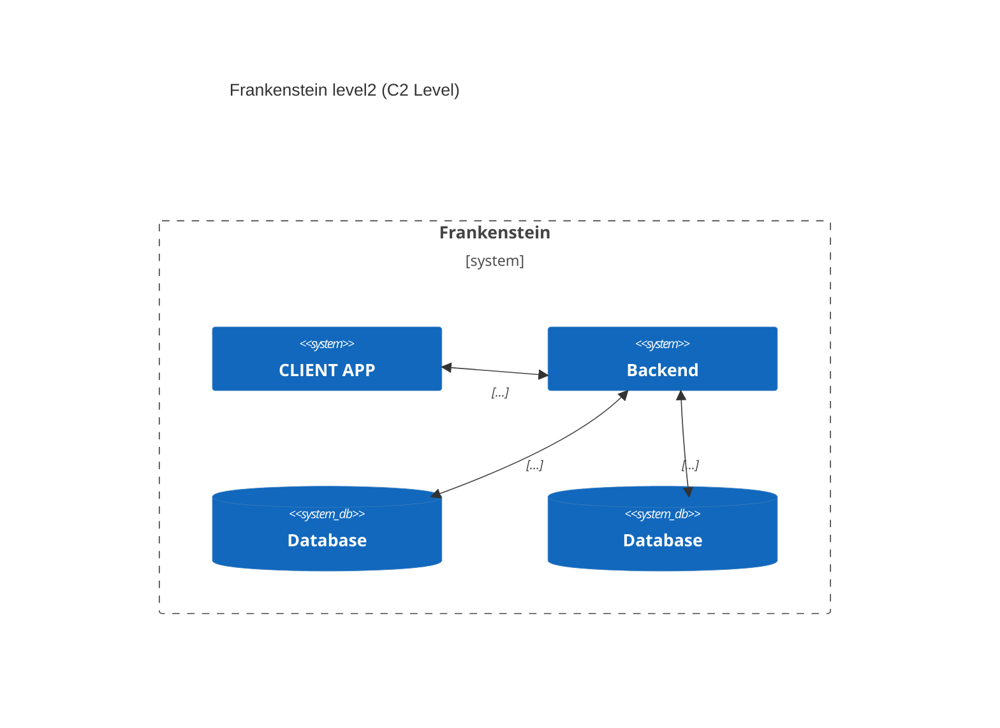

# Frankenstein C4 level2

```mermaid
C4Context

title Frankenstein level2 (C2 Level)

Boundary(system, "Frankenstein") {
    System(web_client_app, "CLIENT APP")
    System(backend, "Backend")

    SystemDb(graph_database, "Database")
    SystemDb(file_database, "Database")

    BiRel(web_client_app, backend, , "...")
    BiRel(backend, graph_database, , "...")
    BiRel(backend, file_database, , "...")
}
```
