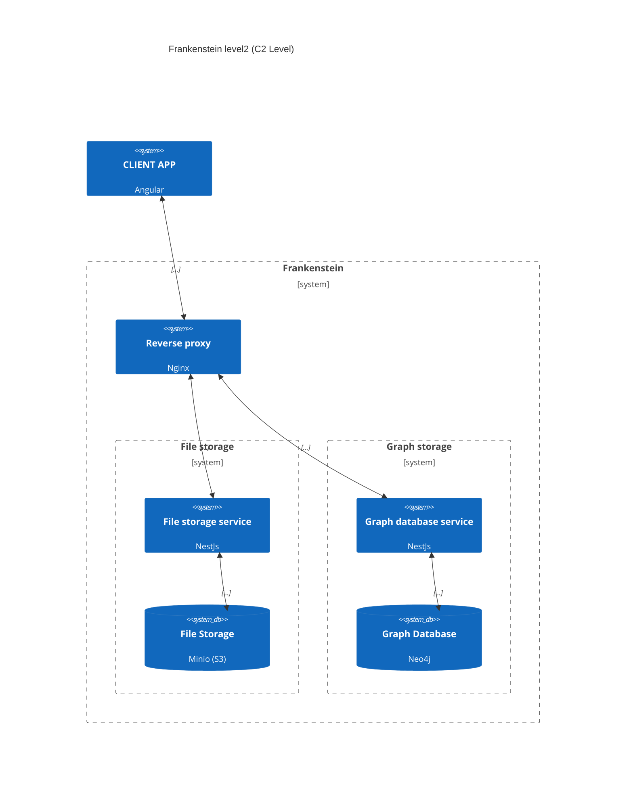

# Frankenstein C4 level2

```mermaid
C4Context

title Frankenstein level2 (C2 Level)

System(web_client_app, "CLIENT APP", "Angular")

Boundary(system, "Frankenstein") {
    System(reverse_proxy, "Reverse proxy", "Nginx")
    BiRel(web_client_app, reverse_proxy, , "...")
    BiRel(reverse_proxy, graph_db_backend, , "...")
    BiRel(reverse_proxy, file_storage_backend, , "...")

    Boundary(file_storage, "File storage") {
        System(file_storage_backend, "File storage service", "NestJs")
        SystemDb(file_storage, "File Storage", "Minio (S3)")
        BiRel(file_storage_backend, file_storage, , "...")

    }

     Boundary(graph_storage, "Graph storage") {
        System(graph_db_backend, "Graph database service", "NestJs")
        SystemDb(graph_database, "Graph Database", "Neo4j")
        BiRel(graph_db_backend, graph_database, , "...")
    }
}

UpdateLayoutConfig($c4ShapeInRow="1", $c4BoundaryInRow="2")
```
