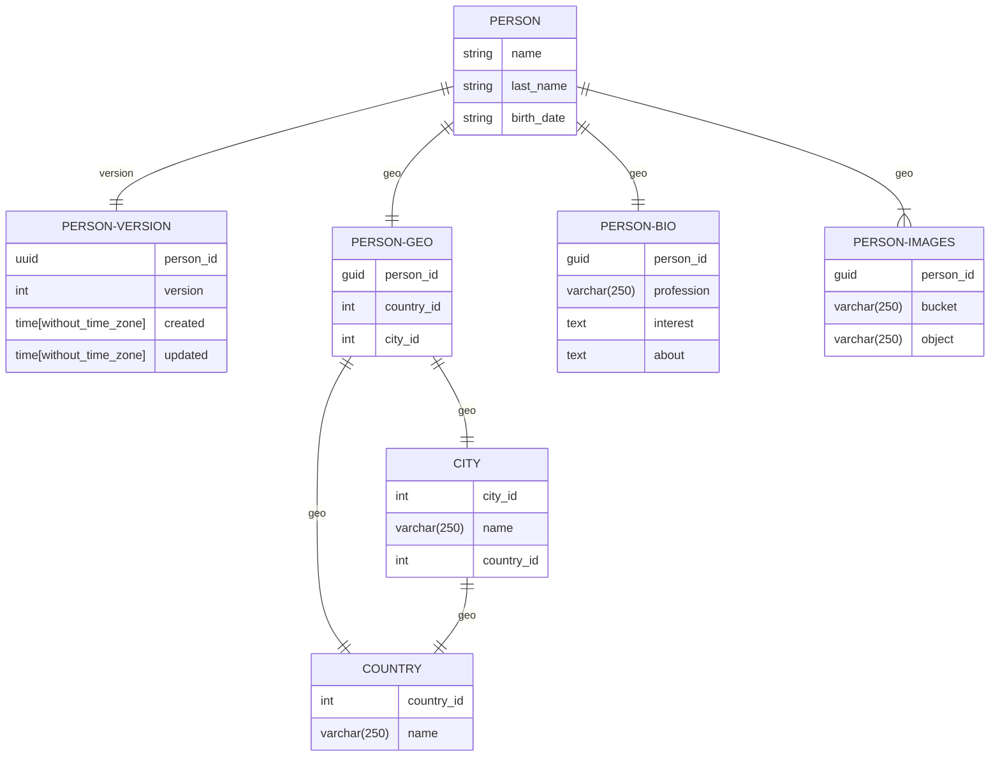
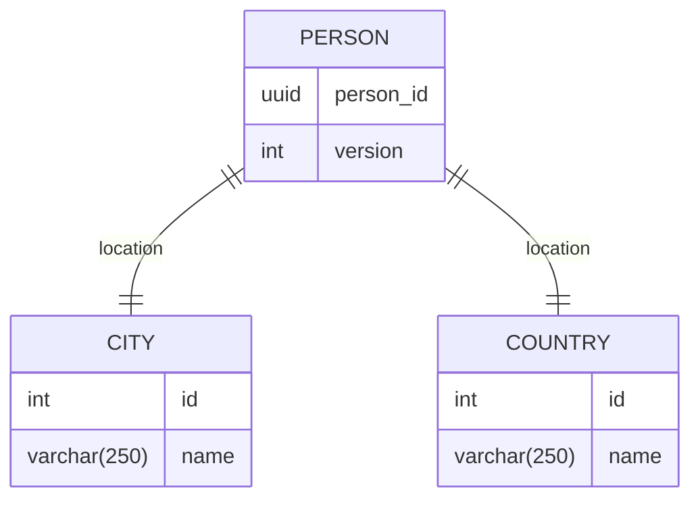

# PostgresSQL Shema

```mermaid
erDiagram

    PERSON {
        string name
        string last_name
        string birth_date
    }

    PERSON ||--||  PERSON-VERSION : version
    PERSON-VERSION {
        uuid person_id
        int version
        time[without_time_zone] created
        time[without_time_zone] updated
    }

    PERSON ||--||  PERSON-GEO : geo
    PERSON-GEO {
        guid person_id
        int country_id
        int city_id
    }

    PERSON ||--||  PERSON-BIO : geo
    PERSON-BIO {
        guid person_id
        varchar(250) profession
        text interest
        text about
    }

    PERSON ||--|{  PERSON-IMAGES : geo
    PERSON-IMAGES {
        guid person_id
        varchar(250) bucket
        varchar(250) object
    }

    PERSON-GEO ||--||  CITY : geo
    CITY {
        int city_id
        varchar(250) name
        int country_id
    }

    PERSON-GEO ||--||  COUNTRY : geo
    COUNTRY {
        int country_id
        varchar(250) name
    }

CITY  ||--||  COUNTRY : geo
```

# NEO4J

```mermaid
erDiagram

    PERSON {
        uuid person_id
        int version
    }

    PERSON ||--||  CITY : location
    CITY {
        int id
        varchar(250) name
    }

    PERSON ||--||  COUNTRY : location
    COUNTRY {
        int id
        varchar(250) name
    }
```
