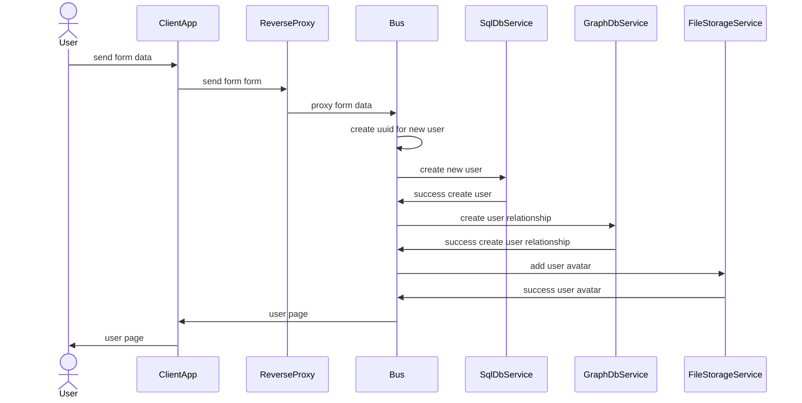

# User Fflow

## Create user

```mermaid
sequenceDiagram
    actor User;
    participant ClientApp;
    participant ReverseProxy;

    participant Bus;

    participant SqlDbService;
    participant GraphDbService;
    participant FileStorageService;

    User->>ClientApp: send form data;

    ClientApp->>ReverseProxy: send form form;

    ReverseProxy->>Bus: proxy form data;

    Bus->>Bus: create uuid for new user;

    Bus->>SqlDbService: create new user;
    SqlDbService->>Bus: success create user;

    Bus->>GraphDbService: create user relationship;
    GraphDbService->>Bus: success create user relationship;

    Bus->>FileStorageService: add user avatar;
    FileStorageService->>Bus: success user avatar;

    Bus->>ClientApp: user page;
    ClientApp->>User: user page;
```
