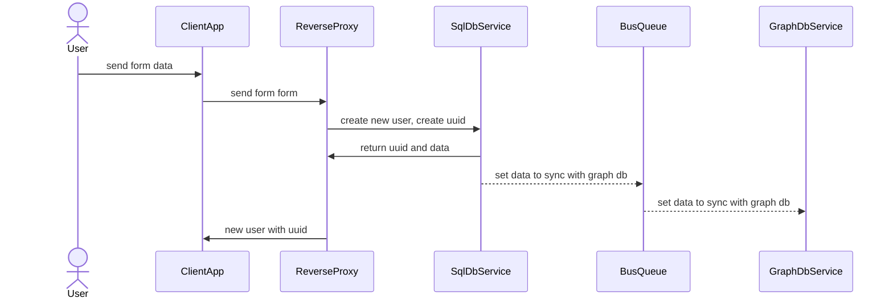
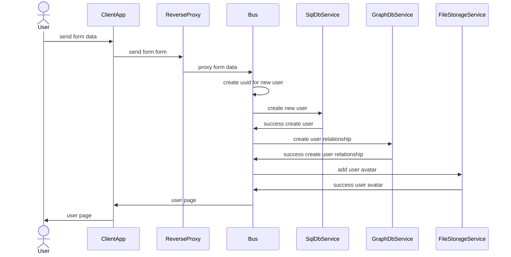

# User story

## Создание пользователя

Создание пользователя
Сперва сохраняем все данные в PostgreSQL включая relationship
Создаем запись в бд + добавляем версию = 1 + генерируем сквозной uuid

Далее синхронизируем данные через очередь в графовую бд

## Поиск пользователей [WIP]

